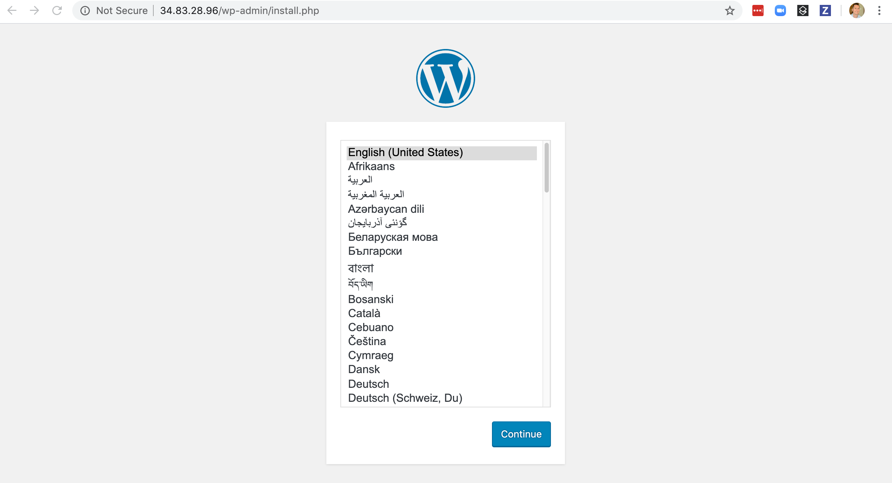

# Wordpress Quick Start
This guide walks through deploying the Wordpress application using Crossplane.

## Overview
 - [Setup Environment]
 - [Install Provider and Stack]
 - [Install Application]
 - [Cleanup]
 - [Debugging]

## Setup Environment
### Create a Crossplane Environment
* Create a Crossplane environment as your control plane for your apps and
infrastructure. 
   * To setup an environment by hand, [install crossplane] from the
alpha channel.

* Create an application namespace `workspace1` in your Crossplane environment.

### Install the Crossplane CLI
```
curl -sL https://raw.githubusercontent.com/crossplane/crossplane-cli/master/bootstrap.sh | bash
```
See [Crossplane CLI] for details.

## Install Provider and Stack
Wordpress can be deployed on top of any stack that provides the default
resource classes it needs as part of its self-service catalog.

This guide walks through 3 cloud provider options:
 - [GCP Provider and Stack]
 - [AWS Provider and Stack]
 - [Azure Provider and Stack]

 Select one of the above and then continue to [Install Application].

### GCP Provider and Stack


#### Install GCP Provider
```
# optional alternate registry
# REGISTRY=registry.upbound.io

PACKAGE=crossplane/provider-gcp:v0.9.0
NAME=provider-gcp
kubectl crossplane package install --cluster --namespace crossplane-system ${PACKAGE} ${NAME} ${REGISTRY}
```

#### Install GCP Sample Stack
```
# optional alternate registry
# REGISTRY=registry.upbound.io

PACKAGE=crossplane/stack-gcp-sample:v0.5.0
NAME=stack-gcp-sample
kubectl crossplane package install --cluster --namespace crossplane-system ${PACKAGE} ${NAME} ${REGISTRY}
```

See [GCP Sample Stack] for details.

#### Verify packages installed and ready
```
kubectl get clusterpackageinstall -A
```

and wait for them to be `Ready:True`
```
NAMESPACE           NAME               READY   SOURCE                PACKAGE
crossplane-system   provider-gcp       True    registry.upbound.io   crossplane/provider-gcp:v0.9.0
crossplane-system   stack-gcp-sample   True    registry.upbound.io   crossplane/stack-gcp-sample:v0.5.0
```

#### Create gcp-secret.json
Run the following replacing `MY_GCP_PROJECT_ID` with your own:
```
curl -s https://raw.githubusercontent.com/crossplane/stack-minimal-gcp/master/hack/gcp-credentials.sh | PROJECT_ID=[MY_GCP_PROJECT_ID] bash -
```

Save the secret JSON in the output to the file `gcp-secret.json` and be sure to delete it later!

#### Generate stack.yaml

Run the following to generate the `stack.yaml` replacing `MY_GCP_PROJECT_ID` with your own:
```
STACK_NAME=my-cool-stack
GCP_PROJECT_ID=MY_GCP_PROJECT_ID
GCP_REGION=us-west1
GCP_ACCOUNT_SECRET_NAMESPACE=crossplane-system
GCP_ACCOUNT_SECRET_CREDS=$(base64 gcp-secret.json | tr -d "\n")

cat > stack.yaml <<EOF
---
apiVersion: v1
kind: Secret
metadata:
  name: gcp-account-creds
  namespace: ${GCP_ACCOUNT_SECRET_NAMESPACE}
type: Opaque
data:
  credentialsKeyBody: ${GCP_ACCOUNT_SECRET_CREDS}
---
apiVersion: gcp.stacks.crossplane.io/v1alpha1
kind: GCPSample
metadata:
  name: ${STACK_NAME}
spec:
  # replace this with your own gcp project id
  projectID: ${GCP_PROJECT_ID}
  region: ${GCP_REGION}
  credentialsSecretRef:
    namespace: ${GCP_ACCOUNT_SECRET_NAMESPACE}
    name: gcp-account-creds
    key: credentialsKeyBody
EOF
```
 
The resulting `stack.yaml` looks like this:
```
apiVersion: v1
kind: Secret
metadata:
  name: gcp-account-creds
  namespace: crossplane-system
type: Opaque
data:
  credentialsKeyBody: <redacted>
---
apiVersion: gcp.stacks.crossplane.io/v1alpha1
kind: GCPSample
metadata:
  name: my-cool-stack
spec:
  # replace this with your own gcp project id
  projectID: crossplane-playground
  region: us-west1
  credentialsSecretRef:
    namespace: crossplane-system
    name: gcp-account-creds
    key: credentialsKeyBody
```

#### Apply the stack.yaml
```
kubectl apply -f stack.yaml
```

Verify the `GCPSample` stack resource is successfully reconciled:
```
kubectl get gcpsample -A -o yaml
```

Verify the `GCPSample` resource was created and has a `status.conditions` of `Synced` and `status:True`.
```
apiVersion: v1
items:
- apiVersion: gcp.stacks.crossplane.io/v1alpha1
  kind: GCPSample
  metadata:
    annotations:
      kubectl.kubernetes.io/last-applied-configuration: |
        {"apiVersion":"gcp.stacks.crossplane.io/v1alpha1","kind":"GCPSample","metadata":{"annotations":{},"name":"my-cool-stack"},"spec":{"credentialsSecretRef":{"key":"credentialsKeyBody","name":"gcp-account-creds","namespace":"crossplane-system"},"projectID":"crossplane-playground","region":"us-west1"}}
    creationTimestamp: "2020-04-29T16:57:30Z"
    generation: 1
    name: my-cool-stack
    resourceVersion: "2805904"
    selfLink: /apis/gcp.stacks.crossplane.io/v1alpha1/gcpsamples/my-cool-stack
    uid: 6c7fb347-af02-4d77-a2a6-ac3e73fb86ec
  spec:
    credentialsSecretRef:
      key: credentialsKeyBody
      name: gcp-account-creds
      namespace: crossplane-system
    projectID: crossplane-playground
    region: us-west1
  status:
    conditions:
    - lastTransitionTime: "2020-04-29T16:57:33Z"
      reason: Successfully reconciled resource
      status: "True"
      type: Synced
```

Once the `Stack` is installed and configured skip to [Install Application].

### AWS Provider and Stack
#### Install AWS Provider
```
# optional alternate registry
# REGISTRY=registry.upbound.io

PACKAGE=crossplane/provider-aws:v0.9.0
NAME=provider-aws
kubectl crossplane package install --cluster --namespace crossplane-system ${PACKAGE} ${NAME} ${REGISTRY}
```

#### Install AWS Sample Stack
```
# optional alternate registry
# REGISTRY=registry.upbound.io

PACKAGE=crossplane/stack-aws-sample:v0.5.0
NAME=stack-aws-sample
kubectl crossplane package install --cluster --namespace crossplane-system ${PACKAGE} ${NAME} ${REGISTRY}
```

See [AWS Sample Stack] for details.

#### Verify packages installed and ready
```
kubectl get clusterpackageinstall -A
```

and wait for them to be `Ready:True`
```
NAMESPACE           NAME               READY   SOURCE                PACKAGE
crossplane-system   provider-aws       False   registry.upbound.io   crossplane/provider-aws:v0.9.0
crossplane-system   stack-aws-sample   False   registry.upbound.io   crossplane/stack-aws-sample:v0.5.0
```

#### Create aws-secret.conf
Run the following to get your AWS Provider credentials. This requires the `aws` CLI tool to be installed and configured.
```
AWS_PROFILE=default && echo -e "[default]\naws_access_key_id = $(aws configure get aws_access_key_id --profile $AWS_PROFILE)\naws_secret_access_key = $(aws configure get aws_secret_access_key --profile $AWS_PROFILE)"
```

Save the secret config in the output to the file `aws-secret.conf` and be sure to delete it later!

#### Generate stack.yaml

Run the following to generate the `stack.yaml`: 
```
STACK_NAME=my-cool-stack
AWS_REGION=us-west-2
AWS_ACCOUNT_SECRET_NAMESPACE=crossplane-system
AWS_ACCOUNT_SECRET_CREDS=$(base64 aws-secret.conf | tr -d "\n")

cat > stack.yaml <<EOF
---
apiVersion: v1
kind: Secret
metadata:
  name: aws-account-creds
  namespace: ${AWS_ACCOUNT_SECRET_NAMESPACE}
type: Opaque
data:
  credentialsKeyBody: ${AWS_ACCOUNT_SECRET_CREDS}
---
apiVersion: aws.stacks.crossplane.io/v1alpha1
kind: AWSSample
metadata:
  name: ${STACK_NAME}
spec:
  region: ${AWS_REGION}
  credentialsSecretRef:
    key: credentialsKeyBody
    name: aws-account-creds
    namespace: ${AWS_ACCOUNT_SECRET_NAMESPACE}
EOF
```

The resulting `stack.yaml` looks like this:
```
---
apiVersion: v1
kind: Secret
metadata:
  name: aws-account-creds
  namespace: crossplane-system
type: Opaque
data:
  credentialsKeyBody: <redacted>
---
apiVersion: aws.stacks.crossplane.io/v1alpha1
kind: AWSSample
metadata:
  name: my-cool-stack
spec:
  region: us-west-2
  credentialsSecretRef:
    key: credentialsKeyBody
    name: aws-account-creds
    namespace: crossplane-system
```

#### Apply the stack.yaml
```
kubectl apply -f stack.yaml
```

Verify the `GCPSample` stack resource is successfully reconciled:
```
kubectl get awssample -A -o yaml
```

Verify the `AWSSample` resource was created and has a `status.conditions` of `Synced` and `status:True`.
```
apiVersion: v1
items:
- apiVersion: aws.stacks.crossplane.io/v1alpha1
  kind: AWSSample
  metadata:
    annotations:
      kubectl.kubernetes.io/last-applied-configuration: |
        {"apiVersion":"aws.stacks.crossplane.io/v1alpha1","kind":"AWSSample","metadata":{"annotations":{},"name":"my-cool-stack"},"spec":{"credentialsSecretRef":{"key":"credentialsKeyBody","name":"aws-account-creds","namespace":"crossplane-system"},"region":"us-west-2"}}
    creationTimestamp: "2020-04-29T23:12:17Z"
    generation: 1
    name: my-cool-stack
    resourceVersion: "2901308"
    selfLink: /apis/aws.stacks.crossplane.io/v1alpha1/awssamples/my-cool-stack
    uid: c902828c-4730-480c-878b-675c61ed8fad
  spec:
    credentialsSecretRef:
      key: credentialsKeyBody
      name: aws-account-creds
      namespace: crossplane-system
    region: us-west-2
  status:
    conditions:
    - lastTransitionTime: "2020-04-29T23:12:20Z"
      reason: Successfully reconciled resource
      status: "True"
      type: Synced
kind: List
metadata:
  resourceVersion: ""
  selfLink: ""
```

Once the `Stack` is installed and configured skip to [Install Application].

### Azure Provider and Stack
#### Install Azure Provider
```
# optional alternate registry
# REGISTRY=registry.upbound.io

PACKAGE=crossplane/provider-azure:v0.9.0
NAME=provider-azure
kubectl crossplane package install --cluster --namespace crossplane-system ${PACKAGE} ${NAME} ${REGISTRY}
```

#### Install Azure Sample Stack
```
# optional alternate registry
# REGISTRY=registry.upbound.io

PACKAGE=crossplane/stack-azure-sample:v0.5.0
NAME=stack-azure-sample
kubectl crossplane package install --cluster --namespace crossplane-system ${PACKAGE} ${NAME} ${REGISTRY}
```

See [Azure Sample Stack] for details.

#### Verify packages installed and ready
```
kubectl get clusterpackageinstall -A
```

and wait for them to be `Ready:True`
```
NAMESPACE           NAME                 READY   SOURCE                PACKAGE
crossplane-system   provider-azure       True    registry.upbound.io   crossplane/provider-azure:v0.9.0
crossplane-system   stack-azure-sample   True    registry.upbound.io   crossplane/stack-azure-sample:v0.5.0
```

#### Create azure-secret.json
Run the following:
```
curl -s https://raw.githubusercontent.com/crossplane/stack-azure-sample/master/hack/azure-credentials.sh | bash -
```

Save the secret JSON in the output to the file `azure-secret.json` and be sure to delete it later!

#### Generate stack.yaml

Run the following to generate the `stack.yaml`:
```
STACK_NAME=my-cool-stack
AZURE_REGION=us-west-2
AZURE_ACCOUNT_SECRET_NAMESPACE=crossplane-system
AZURE_ACCOUNT_SECRET_CREDS=$(base64 azure-secret.json | tr -d "\n")

cat > stack.yaml <<EOF
---
apiVersion: v1
kind: Secret
metadata:
  name: azure-account-creds
  namespace: ${AZURE_ACCOUNT_SECRET_NAMESPACE}
type: Opaque
data:
  credentialsKeyBody: ${AZURE_ACCOUNT_SECRET_CREDS}
---
apiVersion: azure.stacks.crossplane.io/v1alpha1
kind: AzureSample
metadata:
  name: ${STACK_NAME}
spec:
  region: ${AZURE_REGION}
  credentialsSecretRef:
    key: credentialsKeyBody
    name: azure-account-creds
    namespace: ${AZURE_ACCOUNT_SECRET_NAMESPACE}
EOF
```

This will output a `stack.yaml` file that looks like this:
```
---
apiVersion: v1
kind: Secret
metadata:
  name: azure-account-creds
  namespace: crossplane-system
type: Opaque
data:
  credentialsKeyBody: <redacted> 
---
apiVersion: azure.stacks.crossplane.io/v1alpha1
kind: AzureSample
metadata:
  name: my-cool-stack
spec:
  region: us-west-2
  credentialsSecretRef:
    key: credentialsKeyBody
    name: azure-account-creds
    namespace: crossplane-system
```

#### Apply the stack.yaml
```
kubectl apply -f stack.yaml
```

Verify the `AzureSample` stack resource is successfully reconciled:
```
kubectl get azuresample -A -o yaml
```

Verify the `AzureSample` resource was created and has a `status.conditions` of `Synced` and `status:True`.
```
apiVersion: v1
items:
- apiVersion: azure.stacks.crossplane.io/v1alpha1
  kind: AzureSample
  metadata:
    annotations:
      kubectl.kubernetes.io/last-applied-configuration: |
        {"apiVersion":"azure.stacks.crossplane.io/v1alpha1","kind":"AzureSample","metadata":{"annotations":{},"name":"my-cool-stack"},"spec":{"credentialsSecretRef":{"key":"credentialsKeyBody","name":"azure-account-creds","namespace":"crossplane-system"},"region":"us-west-2"}}
    creationTimestamp: "2020-04-29T23:29:30Z"
    generation: 1
    name: my-cool-stack
    resourceVersion: "2911215"
    selfLink: /apis/azure.stacks.crossplane.io/v1alpha1/azuresamples/my-cool-stack
    uid: 0d6dc42b-2806-495a-bc07-f1c5dd4a9c2b
  spec:
    credentialsSecretRef:
      key: credentialsKeyBody
      name: azure-account-creds
      namespace: crossplane-system
    region: us-west-2
  status:
    conditions:
    - lastTransitionTime: "2020-04-29T23:29:33Z"
      reason: Successfully reconciled resource
      status: "True"
      type: Synced
kind: List
metadata:
  resourceVersion: ""
  selfLink: ""
```

Once the `Stack` is installed and configured skip to [Install Application].

## Install Application
### Install the Wordpress Application
```
# optional alternate registry
# REGISTRY=registry.upbound.io

PACKAGE=crossplane/app-wordpress:v0.4.0
NAMESPACE=workspace1
NAME=app-wordpress
kubectl crossplane package install --namespace ${NAMESPACE} ${PACKAGE} ${NAME} ${REGISTRY}
```

### Verify packages installed and ready
```
kubectl get packageinstall -A
```

and wait for it to be `Ready:True`
```
NAMESPACE    NAME            READY   SOURCE                PACKAGE
workspace1   app-wordpress   True    registry.upbound.io   crossplane/app-wordpress:v0.4.0
```

### Create app.yaml
Run the following:
```
APP_NAMESPACE=workspace1
APP_NAME=my-cool-app

cat > app.yaml <<EOF
apiVersion: wordpress.apps.crossplane.io/v1alpha1
kind: WordpressInstance
metadata:
  namespace: ${APP_NAMESPACE}
  name: ${APP_NAME}
spec:
  provisionPolicy: ProvisionNewCluster
EOF
```

The resulting `app.yaml` should look like this:
```
apiVersion: wordpress.apps.crossplane.io/v1alpha1
kind: WordpressInstance
metadata:
  namespace: workspace1
  name: my-cool-app
spec:
  provisionPolicy: ProvisionNewCluster
```

### Apply the app.yaml
```
kubectl apply -f app.yaml
```

Verify the `WordpressInstance` was created:
```
kubectl get -A wordpressinstance
```

which should show:
```
NAME          AGE
my-cool-app   78m
```

Then watch for the `KubernetesCluster` and `MySQLInstance` to become bound:
```
kubectl get -A kubernetescluster
kubectl get -A mysqlinstance
```

These results show `Wordpress` deployed on top of the `GCP Sample Stack` and being bound to the `GKEClusterClass` and `CloudSQLInstanceClass`:
```
NAME                  STATUS   CLASS-KIND              CLASS-NAME                                  RESOURCE-KIND      RESOURCE-NAME                          AGE
my-cool-app-cluster            GKEClusterClass         my-cool-stack-gkeclusterclass               GKECluster         workspace1-my-cool-app-cluster-swh68   8m
my-cool-app-sql       Bound    CloudSQLInstanceClass   my-cool-stack-cloudsqlinstanceclass-mysql   CloudSQLInstance   workspace1-my-cool-app-sql-cfqhz       8m
```

The `KubernetesCluster` above is not `Bound` yet and the provisioning status is found on the underlying managed resource:
```
GROUP=$(kubectl get kubernetescluster -n workspace1 -o=jsonpath='{.items[0].spec.resourceRef.apiVersion}' | awk -F'/' '{print $1}')

KIND=$(kubectl get kubernetescluster -n workspace1 -o=jsonpath='{.items[0].spec.resourceRef.kind}')

NAME=$(kubectl get kubernetescluster -n workspace1 -o=jsonpath='{.items[0].spec.resourceRef.name}')

kubectl get ${KIND}.${GROUP} ${NAME} -o yaml
```

During provisioning there will be a `status.condition` of `Ready: False`.
```
status:
  conditions:
  - lastTransitionTime: "2020-04-30T19:07:55Z"
    reason: Resource is being created
    status: "False"
    type: Ready
```

The `MySQLInstance` provisioning status is found on the underlying managed resource:
```
GROUP=$(kubectl get mysqlinstance -n workspace1 -o=jsonpath='{.items[0].spec.resourceRef.apiVersion}' | awk -F'/' '{print $1}')

KIND=$(kubectl get mysqlinstance -n workspace1 -o=jsonpath='{.items[0].spec.resourceRef.kind}')

NAME=$(kubectl get mysqlinstance -n workspace1 -o=jsonpath='{.items[0].spec.resourceRef.name}')

kubectl get ${KIND}.${GROUP} ${NAME} -o yaml
```

Successful provisoining results in `bindingPhase: Bound` and a `status.condition` of `Ready: True`
```
status:
  bindingPhase: Bound
  conditions:
  - lastTransitionTime: "2020-04-30T19:12:11Z"
    reason: Resource is available for use
    status: "True"
    type: Ready
```

The `KubernetesApplication` contains the `Deployment`, `Namespace`, and `Service` to be deployed to the remote `KubernetesTarget` cluster:
```
kubectl get kubernetesapplication -A -o yaml
```

In summary:
```
spec:
    resourceTemplates:
      spec:
        template:
          apiVersion: v1
          kind: Namespace
          metadata:
            labels:
              app: wordpress
            name: my-cool-app
      spec:
        secrets:
        - name: sql
        template:
          apiVersion: apps/v1
          kind: Deployment
      spec:
        template:
          apiVersion: v1
          kind: Service
          metadata:
            labels:
              app: wordpress
            name: wordpress
            namespace: my-cool-app
          spec:
            ports:
            - port: 80
            selector:
              app: wordpress
            type: LoadBalancer
    targetRef:
      name: my-cool-app-cluster
    targetSelector:
      matchLabels:
        app: my-cool-app
```

Once the `KubernetesCluster` `status` becomes `Bound`, the `KubernetesApplication` will be scheduled to the `KubernetesTarget` and create `KubernetesApplicationResources` (KAR) resources that are control plane representations of the actual `Namespace`, `Deployment`, and `Service` resources that will be created on the remote `KubernetesCluster` when it becomes available.

During provisioning these KAR resources will have the following error `status`
waiting for the `KubernetesTarget` to become available. 
```
kubectl get kubernetesapplicationresources -A -o yaml
```

```
  status:
    conditionedStatus:
      conditions:
      - lastTransitionTime: "2020-04-29T23:14:08Z"
        message: failed to find a usable KubernetesTarget for scheduling
        reason: Encountered an error during resource reconciliation
        status: "False"
        type: Synced
    state: Pending
```

This is normal and Crossplane's continous reconcilation will automatically
resolve this when the target `KubernetesCluster` becomes available.

When the `KubernetesApplication` has been deployed the KAR Service resource
will have the `loadBalancer` IP:
```
kubectl get kubernetesapplicationresources -A -o yaml
```
```
status:
   remote:
      loadBalancer:
        ingress:
        - ip: 34.83.28.96
```

Which shows that `Wordpress` has been deployed at the IP above onto a dynamically provisioned `KubernetesCluster` and `MySQLInstance`:


Note: Azure requires a `MySQLServerVnetRule` to be created *after* the `MySqlInstance` claim is bound as part of deploying the `Application` instance. A new [Composition feature](https://github.com/crossplane/crossplane/issues/1343) will remove this extra step. See [Debugging] for details.

If you run into other issues with your Wordpress deployment see [Debugging].

## Cleanup
### Delete the application instance:
```
kubectl delete wordpressinstance -n workspace1 my-cool-app
```

### Delete the stack instance, using the appropriate command for your cloud provider:
```
kubectl delete gcpsample my-cool-stack

kubectl delete awssample my-cool-stack

kubectl delete azuresample my-cool-stack
```

#### Wait for the `Network` / `VCP` to be cleaned up.
```
kubectl get networks.compute.gcp.crossplane.io
kubectl get subnetworks.compute.gcp.crossplane.io

kubectl get vpcs.network.aws.crossplane.io
kubectl get subnets.network.aws.crossplane.io

kubectl get resourcegroup.azure.crossplane.io
kubectl get virtualnetworks.network.azure.crossplane.io
kubectl get subnets.network.azure.crossplane.io
```

### Delete the `Provider` using the appropriate command for your cloud provider:
```
kubectl delete provider.gcp.crossplane.io my-cool-stack-gcp-provider

kubectl delete provider.aws.crossplane.io my-cool-stack-aws-provider

kubectl delete provider.azure.crossplane.io my-cool-stack-azure-provider
```

### Uninstall Application
```
NAME=app-wordpress
kubectl crossplane package uninstall --namespace workspace1 ${NAME}
```

### Uninstall Stack
Uninstall the Stack with one of the following:
```
NAME=stack-gcp-sample
kubectl crossplane package uninstall --cluster --namespace crossplane-system ${NAME}
```
```
NAME=stack-aws-sample
kubectl crossplane package uninstall --cluster --namespace crossplane-system ${NAME}
```
```
NAME=stack-azure-sample
kubectl crossplane package uninstall --cluster --namespace crossplane-system ${NAME}
```

### Uninstall Provider
Uninstall the Provider with one of the following:
```
NAME=provider-gcp
kubectl crossplane package uninstall --cluster --namespace crossplane-system ${NAME}
```
```
NAME=provider-aws
kubectl crossplane package uninstall --cluster --namespace crossplane-system ${NAME}
```
```
NAME=provider-azure
kubectl crossplane package uninstall --cluster --namespace crossplane-system ${NAME}
```

# Done!

## Debugging
If `Wordpress` doesn't deploy as expected here are a few things to check:
 - `MySQLInstance` is `Bound` and the underlying managed resource has a `status` of `Ready: true`
 - `KubernetesCluster` is `Bound` and the underlying managed resource has a `status` of `Ready: true`
 - `Deployment` and `Service` have been created on the remote `KubernetesTarget` and the container logs look correct.
 - Azure `MySQLServerVirtualNetworkRule` required to open ports to individual `MySQLInstances`

### Verify: MySQLInstance is bound with a status condition of Ready: true
If the `MySQLInstance` is not `Bound` the underlying managed resource will have a `status` with more details.
```
kubectl get -A mysqlinstance -o yaml
```

In a GCP deployment the `MySQLInstance` `spec.resourceRef` will be set to a `CloudSQLInstance`:
```
spec:
    classRef:
      apiVersion: database.gcp.crossplane.io/v1beta1
      kind: CloudSQLInstanceClass
      name: my-cool-stack-cloudsqlinstanceclass-mysql
      uid: 82704895-9ac1-4706-9383-797e5f61006f
    engineVersion: "5.7"
    resourceRef:
      apiVersion: database.gcp.crossplane.io/v1beta1
      kind: CloudSQLInstance
      name: workspace1-my-cool-app-sql-cfqhz
      uid: 81c00371-08f8-4c2a-aa09-f2b1386a0e71
    writeConnectionSecretToRef:
      name: sql
```

The underlying managed resource will have additional `status`:
```
kubectl get -A cloudsqlinstance.database.gcp.crossplane.io -o yaml
```

A successful results has a `spec.status.condition` of `type: Ready` and `status: True`
```
status:
    bindingPhase: Bound
    conditions:
    - lastTransitionTime: "2020-04-29T17:57:32Z"
      reason: Resource is available for use
      status: "True"
      type: Ready
```

Any errors will surface in the above `status` and are typically related to errors in the underlying cloud provider APIs.

### Verify: KubernetesCluster is bound with a status condition of Ready: true
If the `KubernetesCluster` is not `Bound` the underlying managed resource will have a `status` with more details.
```
kubectl get -A kubernetescluster -o yaml
```

in a GCP deployment the `KubernetesCluster` `spec.resourceRef` will be set to a `GCKCluster`
```
spec:
    classRef:
      apiVersion: compute.gcp.crossplane.io/v1alpha3
      kind: GKEClusterClass
      name: my-cool-stack-gkeclusterclass
      uid: cb4eda60-90c1-48bd-a0f1-b122c6224565
    resourceRef:
      apiVersion: compute.gcp.crossplane.io/v1alpha3
      kind: GKECluster
      name: workspace1-my-cool-app-cluster-swh68
      uid: e5d132d7-db70-4ab8-9892-77ea1e097d72
    writeConnectionSecretToRef:
      name: my-cool-app-cluster
```

The underlying managed resource will have additional `status`:
```
kubectl get -A gkecluster.compute.gcp.crossplane.io -o yaml
```

A successful results has a `spec.status.condition` of `type: Ready` and `status: True`
```
status:
    bindingPhase: Bound
    conditions:
    - lastTransitionTime: "2020-04-29T17:57:32Z"
      reason: Resource is available for use
      status: "True"
      type: Ready
```

Any errors will surface in the above `status` and are typically related to errors in the underlying cloud provider APIs.

### Verify: Deployment and Service have been created on the remote KubernetesTarget
If the 'MySQLInstance' and the `KubernetesCluster` have been created, the next
thing to check is that the `Deployment` and `Service` have been created on the
remote `KubernetesTarget` and the container logs look correct.

Create a `remote.kubeconfig` for the remote `KubernetesTarget`:
```
SECRET_NAME=$(kubectl get kubernetestarget -n workspace1 -o=jsonpath='{.items[0].spec.connectionSecretRef.name}')
kubectl get -n workspace1 secret ${SECRET_NAME} --template={{.data.kubeconfig}} | base64 --decode > remote.kubeconfig
```

Verify the following:

`Namespace` `my-cool-app` from the `KubernetesApplication` shows up on the `KubernetesTarget`:
```
kubectl --kubeconfig=remote.kubeconfig get namespaces
```

```
NAME              STATUS   AGE
default           Active   173m
kube-node-lease   Active   173m
kube-public       Active   173m
kube-system       Active   173m
my-cool-app       Active   172m
```

`Deployment` `wordpress` from the `KubernetesApplication` shows up on the `KubernetesTarget`:
```
kubectl --kubeconfig=remote.kubeconfig get -n my-cool-app deployments
```

```
NAME        READY   UP-TO-DATE   AVAILABLE   AGE
wordpress   1/1     1            1           3h2m
```

`Pod` `wordpress-<suffix>` shows up on the `KubernetesTarget`:
```
kubectl --kubeconfig=remote.kubeconfig get -n my-cool-app pods
```
```
NAME                         READY   STATUS    RESTARTS   AGE
wordpress-6d6fd567d4-4zn85   1/1     Running   0          3
```

`Pod` logs look correct and is serving traffic:
```
POD=$(kubectl --kubeconfig=remote.kubeconfig get pods -n my-cool-app -o name)
kubectl --kubeconfig=remote.kubeconfig logs -n my-cool-app ${POD}
```
```
WordPress not found in /var/www/html - copying now...
Complete! WordPress has been successfully copied to /var/www/html
10.128.0.1 - - [29/Apr/2020:19:34:43 +0000] "GET /favicon.ico HTTP/1.1" 200 228 "http://34.83.28.96/wp-admin/install.php" "Mozilla/5.0 (Macintosh; Intel Mac OS X 10_14_6) AppleWebKit/537.36 (KHTML, like Gecko) Chrome/81.0.4044.129 Safari/537.36"
10.128.0.1 - - [29/Apr/2020:20:52:12 +0000] "GET / HTTP/1.1" 302 323 "-" "Mozilla/5.0 (Windows NT 6.1; WOW64) AppleWebKit/537.36 (KHTML, like Gecko) Chrome/51.0.2704.103 Safari/537.36"
10.128.0.1 - - [29/Apr/2020:20:57:26 +0000] "GET / HTTP/1.1" 302 320 "-" "-"
```

`Service` `wordpress` is available with an `EXTERNAL-IP`:
```
kubectl --kubeconfig=remote.kubeconfig get services -n my-cool-app
```
```
NAME        TYPE           CLUSTER-IP       EXTERNAL-IP   PORT(S)        AGE
wordpress   LoadBalancer   172.16.158.197   34.83.28.96   80:32599/TCP   3h13m
```

### Azure `MySQLServerVnetRule` required to open ports to individual `MySQLInstances`
Azure requires a `MySQLServerVnetRule` to be created *after* the
`MySqlInstance` claim is bound as part of deploying the `Application` instance.
A new [Composition feature](https://github.com/crossplane/crossplane/issues/1343) 
will remove this extra step.

Run the following to generate the `vnetrule.yaml`:
```
SERVER_NAME=$(kubectl get mysqlservers -o=jsonpath='{.items[0].metadata.name}')
RES_GROUP_NAME=$(kubectl get mysqlservers -o=jsonpath='{.items[0].spec.forProvider.resourceGroupName}')
SUBNET_NAME=$(kubectl get subnets -o=jsonpath='{.items[0].metadata.name}')
PROVIDER_NAME=$(kubectl get mysqlservers -o=jsonpath='{.items[0].spec.providerRef.name}')

cat > vnetrule.yaml <<EOF
apiVersion: database.azure.crossplane.io/v1alpha3
kind: MySQLServerVirtualNetworkRule
metadata:
  name: my-cool-app-vnetrule
spec:
  serverName: ${SERVER_NAME}
  resourceGroupNameRef:
    name: ${RES_GROUP_NAME}
  properties:
    virtualNetworkSubnetIdRef:
      name: ${SUBNET_NAME}
  reclaimPolicy: Delete
  providerRef:
    name: ${PROVIDER_NAME}
EOF
```

The `vnetrule.yaml` should look like this:
```
apiVersion: database.azure.crossplane.io/v1alpha3
kind: MySQLServerVirtualNetworkRule
metadata:
  name: my-cool-app-vnetrule
spec:
  serverName: workspace1-my-cool-app-sql-jmlnc
  resourceGroupNameRef:
    name: my-cool-stack-resourcegroup
  properties:
    virtualNetworkSubnetIdRef:
      name: my-cool-stack-subnet
  reclaimPolicy: Delete
  providerRef:
    name: my-cool-stack-azure-provider
```

Apply the `vnetrule.yaml`
```
kubectl apply -f vnetrule.yaml
```

Verify the `MySQLServerVirtualNetworkRule` has a `status.condition` of `Ready: true`.
```
kubectl get mysqlservervirtualnetworkrules.database.azure.crossplane.io -n workspace1 -o yaml
```
```
  status:
    conditions:
    - lastTransitionTime: "2020-04-30T02:18:22Z"
      reason: Resource is available for use
      status: "True"
      type: Ready
```

When cleaning up make sure to delete the `MySQLServerVirutalNetworkRule`
```
kubectl delete mysqlservervirtualnetworkrules.database.azure.crossplane.io my-cool-app-vnetrule
```

[install crossplane]: https://github.com/crossplane/crossplane/blob/master/docs/getting-started/install.md#alpha
[GCP Sample Stack]: https://github.com/crossplane/stack-gcp-sample
[AWS Sample Stack]: https://github.com/crossplane/stack-aws-sample
[Azure Sample Stack]: https://github.com/crossplane/stack-azure-sample
[Crossplane CLI]: https://github.com/crossplane/crossplane-cli
[Setup Environment]: #setup-environment
[Install Provider and Stack]: #install-provider-and-stack
[GCP Provider and Stack]: #gcp-provider-and-stack
[AWS Provider and Stack]: #aws-provider-and-stack
[Azure Provider and Stack]: #azure-provider-and-stack
[Install Application]: #install-application
[Cleanup]: #cleanup
[Debugging]: #debugging
